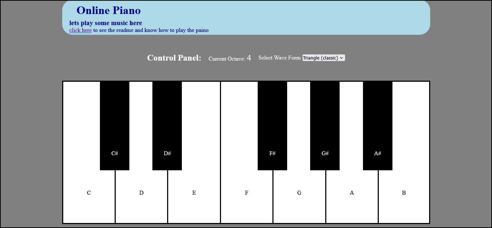

# Piano Website

## Features

a piano with 7 white keys and 5 black keys that are in this order

S -> C, D -> D, F -> E and so on for white keys

while black keys are in this order which is the key on the top right of the key

E -> C#, R -> D#, and so on

the piano supports changing the Octave, Wave form, and holding the sound

## Control panel

### Octave control

Octave is the level of deepness of the key it ranges from 1-10

use up arrow to increase by 2

use down arrow to decrease by 2

use right to increase by 1

use left to decrease by 1

### Wave Form Control

Wave form is the shape of the sound wave and determines the smoothness of the sound

you can choose the wave form that you like for the piano from the selector which contains 4 options

- triangle
- sine
- square
- sawtooth

## Tutorial page

also added a tutorial page for newcomers to learn how to use the piano

## Technology used

this website is made using pure html css javascript and a java script library called Tone.js to produce the tones

## How To Clone
just use this command

`git clone https://github.com/zezo386/piano-website`

## Author

Made by Ziad Elhusiny The GOAT of programming
